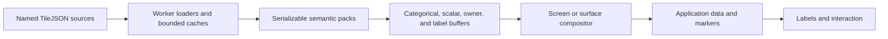

# Next Steps

`bad-map` now has the cross-cutting foundations needed to grow beyond a street
basemap: semantic packs, named sources, quantized scalar fields, time keys,
stable visualization slots, bearing-aware screen rendering, and an experimental
world-space surface renderer.

This document records what landed and the production-depth work that remains.
Every extension must preserve deterministic ranking, nearest-neighbor dot
geometry, independent labels, typed nonfatal failures, and public MapLibre APIs.

## Milestone status

| Milestone                      | Status              | Delivered                                                                                                                                                         |
| ------------------------------ | ------------------- | ----------------------------------------------------------------------------------------------------------------------------------------------------------------- |
| 0. Baseline                    | Complete            | MVT fixtures, semantic tests, visual goldens, browser interactions, performance checks, and API declarations                                                      |
| 1. Greyscale and motion        | Complete            | Linear-light greyscale, cached-frame reprojection, label fading, request coalescing, and exact settled frames                                                     |
| 2. Pack and source core        | Complete            | Serializable descriptors, worker adapter registry, named MVT sources, independent cache/concurrency/retry settings, attribution, errors, and a custom-worker hook |
| 3. Transit reference pack      | Foundation complete | Transit-only filtering, high-rank routes, stations through the point-label pipeline, stable ownership, and street coexistence                                     |
| 4. Numeric and time-aware data | Foundation complete | Quantized scalar texture, weather and elevation defaults, `{time}` tile templates, runtime time updates, and time-keyed caches                                    |
| 5. Visualization and picking   | Complete            | Data, marker, label, and interaction boundaries; owner-texture hover; persistent selection; pack/source-aware queries; filter helper                              |
| 6. Rotation and 3D             | Experimental        | Bearing-aware screen mode, camera-footprint-fitted world surface, geographic picking, and optional theme-aware native building extrusions                         |

The demo exposes the implemented appearance, lattice, camera, pack, source,
and time options in a scrollable side panel. Greyscale is on by default.

## Architecture now in place



### Semantic packs

The built-in registry currently includes:

- `streets`: land, water, buildings, ranked roads, paths, rail, boundaries,
  settlements, and POIs;
- `transit`: rail, subway, tram, busway, ferry, and station subsets with a
  transit-first line rank;
- `topographic`: contours, peaks, land cover, parks, and quantized elevation
  polygons when the source supplies them;
- `weather`: quantized value polygons, high-rank front/pressure lines, and
  observation points;
- `political`: administrative boundaries and population-ranked places;
- `marine`: water, waterways, names, and custom marine source layers;
- `landuse`: land-use, land-cover, park, and building subsets.

Factories return plain serializable objects. Applications needing a different
schema can provide a bundled worker through `workerFactory`; executable adapters
do not run on the main thread or cross `postMessage` as functions.

### Visualization stack

The public ordering contract is:

```text
bad-map-base → bad-map-buildings-3d → bad-map-data → bad-map-markers → bad-map-labels → bad-map-interaction
```

The middle IDs are no-op custom layers used as stable insertion boundaries.
Native MapLibre and interleaved deck.gl layers remain untouched by theme and
greyscale composition.

### Camera modes

`screen` mode projects semantic geometry at the current bearing while keeping
the 2×4 square-dot lattice fixed to the viewport. Cached frames use an affine
pan/zoom/rotation transform until the worker returns an exact replacement.

`surface` mode maps the semantic frame to a flat Web Mercator quad. Bearing and
pitch are supplied by MapLibre's public custom-layer matrix, so the lattice
foreshortens with the surface. The raster frame follows the full camera ground
footprint and trades semantic detail for bounded memory at extreme pitch.
Optional native building extrusions use OpenMapTiles height fields and occupy a
stable slot between the semantic surface and application data. This is
deliberately described as low-resolution 3D rather than terminal emulation.

## Production-depth roadmap

### 1. Richer transit semantics

- Add route-specific palette tokens rather than one route ink.
- Model interchange groups and line shields explicitly.
- Add timetable and live-vehicle overlays through the temporal source API.
- Support a transit-primary mode that suppresses selected street ranks.
- Add transit fixtures in cities with tram, subway, and ferry crossings.

### 2. Topographic and weather depth

- Add multiple numeric channels so elevation, precipitation, temperature, and
  pressure can coexist without repacking one scalar texture.
- Implement temporal prefetch and interpolation between adjacent frames.
- Quantize hillshade into directional tone classes.
- Add wind barbs, indexed contour labels, passes, cliffs, glaciers, and hazard
  markers.
- Publish reference schemas and fixture generators for custom MVT producers.

### 3. Source resilience

- Preserve loader instances when pack membership changes so warm caches survive
  reconfiguration.
- Add exponential retry delay, response-aware retry policy, and request
  instrumentation.
- Support per-source temporal cache budgets and ahead-of-clock prefetch.
- Add raster-array and elevation-tile adapters alongside MVT.
- Add worldview/schema settings to political and administrative adapters.

### 4. Advanced picking

- Add optional offscreen picking for overlapping features instead of returning
  only the winning owner.
- Allow selection of several stable feature keys at once.
- Expose semantic-to-MapLibre filter conversion for application overlays.
- Add keyboard focus and accessible feature navigation in the demo.

### 5. Surface-mode terrain

The current experimental surface is flat. A production 3D implementation
should proceed in this order:

1. Add an optional quantized/dot-style building renderer alongside the current
   smooth native extrusions.
2. Split fills, line dots, and markers into world-space meshes or instances.
3. Replace the foreshortened label texture with anchored billboards and
   screen-space collision.
4. Fade labels and markers near the horizon.
5. Sample MapLibre terrain elevation so primitives follow the ground.
6. Make picking elevation-aware and test it over steep terrain.

The screen renderer should remain independent: enabling terrain must never
change its fixed square-dot grammar.

## Acceptance discipline

Every production-depth addition should include:

- unit tests for projection, adaptation, ranking, and quantization;
- deterministic semantic fixtures for each adapter and temporal state;
- dark, light, color, and greyscale visual goldens;
- browser tests for movement, layer ordering, picking, cleanup, and failures;
- cached and cold performance results at desktop and retina resolutions;
- an intentional public declaration snapshot update;
- migration notes and a demo control when the feature is user-facing.

## Invariants

- Source semantics are reduced before composition; this is not a framebuffer
  pixelation filter.
- Dot geometry remains intentionally low resolution and nearest-neighbor
  sampled.
- Feature and pack ranks are deterministic regardless of response order.
- Labels remain independently composed above consumer data.
- Greyscale affects package-owned cartography only.
- Worker configuration remains serializable.
- Missing sources and tiles degrade locally and emit typed nonfatal errors.
- Screen-space and surface-space rendering remain explicit modes.
