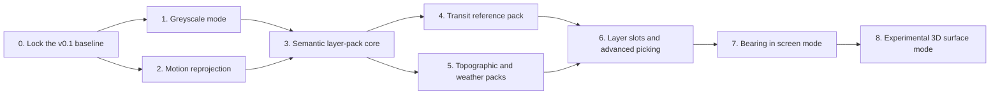

# Next Steps

`bad-map` currently implements a north-up, unpitched street basemap. This
document describes the most useful directions for turning it into a broader
low-resolution cartography toolkit without losing the semantic Braille visual
language.

The work is intentionally incremental. Every milestone should leave a
publishable package, preserve the current street renderer, and include its own
tests and migration notes.

## Implementation sequence



Greyscale and motion can be developed independently after the baseline tests
are in place. Multi-source loading and non-street packs should wait for the
semantic layer-pack contract, while 3D should build on the stabilized pack and
interaction APIs rather than introducing a second feature model.

### Current status

- Milestone 0 is complete in `0.2.0`: deterministic MVT fixtures, semantic
  tests, NYC and Portland visual goldens, standard and retina greyscale
  baselines, Playwright interactions, performance checks, and an API
  declaration snapshot are installed.
- Milestone 1 is complete in `0.2.0`: greyscale composition, style events,
  pan/zoom semantic-texture reprojection, stale-label translation and fading,
  motion-aware hit testing, throttled worker refreshes, and exact `moveend`
  frames are implemented.
- Milestone 2, the semantic pack and named-source core, is next.

## 1. Improve panning and zooming

The worker already produces throttled frames during movement and an exact
frame after `moveend`. The next step is to make movement feel continuous even
when a new semantic frame is still being prepared.

### Proposed approach

1. Record the camera center and zoom associated with every completed frame.
2. Reproject the latest semantic textures in the base-layer vertex shader
   while the camera is moving.
3. Keep the square-dot lattice fixed in screen space. Translate and scale the
   semantic image underneath it using nearest-neighbor sampling.
4. Request worker frames at a limited rate during interaction and replace the
   temporary reprojection when a newer frame arrives.
5. Always request an exact, pixel-aligned frame on `moveend`.

Labels need separate treatment. Short pans can translate the last label
texture, but zooming should fade or hide stale labels until the worker has
performed collision placement for the new view. Native MapLibre data layers
continue to move every animation frame and remain between the base and label
layers.

### Acceptance criteria

- Panning and scroll zooming remain responsive when tile requests are slow.
- The screen-space dot lattice never swims or becomes blurry.
- Old frames are never displayed after a newer generation has arrived.
- Settled labels return to exact character-cell positions.
- No semantic rasterization runs on the main thread.

## 2. Greyscale mode

Greyscale should be a composition mode, not a third hard-coded theme. This
keeps it compatible with built-in and custom themes and automatically applies
to future layer packs.

### Proposed API

```ts
const basemap = new LowResBasemap({
  theme: "dark",
  colorMode: "greyscale",
});

basemap.setColorMode("color");
basemap.setColorMode("greyscale");
```

Add the following public types and events:

```ts
type LowResColorMode = "color" | "greyscale";

interface LowResEventMap {
  // Existing events remain unchanged.
  stylechange: {
    target: LowResBasemapLike;
    theme: LowResTheme;
    colorMode: LowResColorMode;
  };
}
```

### Rendering design

1. Keep the source theme immutable.
2. Derive a composed theme whenever `theme` or `colorMode` changes.
3. Convert sRGB channels to linear light, calculate relative luminance, then
   convert the luminance back to sRGB. Do not average RGB channels directly.
4. Apply a small contrast remap around the ground color so water, parks,
   buildings, road ranks, and label ranks remain distinguishable.
5. Send the derived palette to the base-layer uniforms and label canvas.
6. Trigger a repaint without requesting new tiles or rerunning semantic
   rasterization.

The mode must only affect `bad-map` layers. MapLibre and deck.gl visualization
layers placed between the base and labels retain their original colors.

### Greyscale acceptance criteria

- Every emitted theme color has equal red, green, and blue channels.
- Dark and light themes retain their original background polarity.
- Major roads remain more prominent than minor roads.
- Water, parks, urban areas, and buildings remain visually separable.
- Labels meet the project's contrast thresholds against their backgrounds.
- Toggling the mode does not fetch tiles or advance the worker generation.
- Custom themes are not mutated.
- Color visualization overlays remain unchanged.

### Greyscale test plan

- Unit-test sRGB/linear-light conversion and contrast remapping.
- Snapshot every derived semantic palette.
- Test custom-theme immutability and deterministic output.
- Add dark and light visual goldens at multiple device-pixel ratios.
- Use Playwright to verify runtime toggling and unchanged overlay pixels.
- Add a demo control and an API example to the main README.

## 3. Rotation, pitch, and orbiting in 3D

True orbiting is not just a camera toggle. The current renderer assumes that
the map is a flat, north-up rectangle and that every Braille dot occupies a
fixed screen-space square. Pitching that texture would distort the squares,
while keeping the squares fixed changes how geographic features intersect the
lattice.

The recommended solution is to support two explicit rendering modes.

### `screen` mode

This remains the default and preserves the current terminal-cell appearance.

- Bearing may eventually be supported by projecting geometry through the
  current MapLibre camera before worker rasterization.
- Dots remain square and locked to the viewport.
- Pitch remains zero.
- Labels use the existing character-cell collision grid.

### `surface` mode

This mode supports pitch, bearing, terrain, and orbit controls.

- Convert semantic line and polygon buffers into low-resolution world-space
  meshes or instanced dot primitives.
- Render those primitives with MapLibre's custom-layer camera matrix.
- Let dots foreshorten with the map surface rather than pretending they are
  terminal cells.
- Render labels as separately anchored billboards, with screen-space collision
  detection and optional horizon fading.
- Sample MapLibre terrain elevation, when enabled, so geometry follows the
  ground instead of intersecting it.

This mode should be described as _low-resolution 3D_ rather than a literal
terminal emulation. Keeping the modes separate avoids weakening the visual
rules of the original north-up renderer.

### Suggested API

```ts
basemap.setProjectionMode("surface");

const basemap = new LowResBasemap({
  projectionMode: "surface",
  camera: {
    rotation: true,
    pitch: true,
    maxPitch: 70,
  },
});
```

### Implementation stages

1. Add bearing support to `screen` mode.
2. Prototype instanced world-space dots on a flat plane.
3. Add pitched line and polygon meshes.
4. Add billboard labels and horizon-aware collision rules.
5. Integrate MapLibre terrain and elevation-aware feature queries.

## 4. Layer packs beyond streets

The core renderer should not grow into one large table of special cases.
Instead, new map types should be implemented as semantic **layer packs**. A
pack declares which source and source layers it needs, selects a worker-side
adapter, assigns ranks and styles, and contributes label rules.

Public pack options must be serializable because configuration crosses a Web
Worker boundary. Executable adapters live in a worker-side registry; arbitrary
functions cannot be passed through `postMessage`.

```ts
interface LowResLayerPackDescriptor {
  id: string;
  source: string;
  adapter: "streets" | "transit" | "topographic" | "weather";
  sourceLayers: string[];
  style: LowResStyleRules;
  labels?: LowResLabelRules;
  enabled?: boolean;
}

const basemap = new LowResBasemap({
  layers: [streets(), terrain(), weather({ radarUrl })],
});
```

Internally, each adapter implements a `LayerPackRuntime` interface containing
the executable `adapt` function. A later advanced API may accept a custom
worker URL or worker factory so applications can bundle their own runtime
adapters without moving feature adaptation onto the main thread.

All packs should resolve into the existing semantic buffers wherever possible:

- categorical area fills;
- ranked Braille masks;
- ribbons or secondary masks;
- feature-owner IDs;
- independently composed labels and markers.

Additional numeric textures can be introduced for continuous data such as
elevation, temperature, or precipitation.

### Recommended packs

#### Transit

- Rail, subway, tram, ferry, and bus corridors
- Route colors, station anchors, interchanges, and line shields
- Optional timetable or live-vehicle overlays
- A transit-first rank table that suppresses minor streets

#### Topographic

- Hypsometric elevation bands
- Braille contour lines and indexed contour labels
- Peaks, passes, cliffs, glaciers, and protected areas
- Hillshade reduced to a small number of directional tone classes

#### Weather

- Radar or forecast grids quantized into categorical dot textures
- Wind barbs, fronts, pressure contours, and station observations
- Time-indexed frames with interpolation outside the semantic worker
- A stable geographic grid so animation does not shimmer

#### Political and administrative

- Country, state, county, and municipal boundaries
- Disputed-boundary styles and maritime zones
- Population-ranked settlement labels
- Configurable worldview and language rules

#### Marine

- Bathymetric bands, coastlines, shipping lanes, buoys, and ports
- Depth contours and hazard markers
- Tidal or current visualizations as optional animated overlays

#### Land use and ecology

- Forest, wetland, agriculture, industrial, and residential categories
- Trails and protected-area boundaries
- Habitat, fire, drought, or environmental monitoring overlays

## 5. Multiple sources and schemas

Layer packs will often need more than one source. Extend the source model from
one OpenMapTiles endpoint to named sources:

```ts
sources: {
  base: { tileJSON: "...", schema: "openmaptiles" },
  terrain: { tileJSON: "...", schema: "terrarium-vector" },
  weather: { url: "...", type: "raster-array" },
}
```

Adapters should own schema-specific property mapping. Rasterization should
only receive normalized semantic features. This keeps OpenMapTiles behavior
stable while allowing custom, application-specific tiles.

Source work should also add:

- per-source request transforms and authentication;
- independent cache and concurrency limits;
- temporal keys for animated data;
- attribution aggregation;
- source-specific nonfatal errors and retry policies.

## 6. Visualization integration

The existing base/labels split is the foundation for richer visualizations.
Future releases should make layer placement explicit and provide more slots:

```text
fills → linework → application data → markers → labels → interaction
```

Useful additions include:

- stable layer-slot IDs rather than only `base` and `labels`;
- deck.gl interleaving examples;
- helpers for converting a semantic class into a MapLibre filter;
- hover highlighting in a dedicated texture;
- selection state independent of the current owner grid;
- optional offscreen picking for dense or overlapping features.

The compositor must continue to affect only `bad-map` textures. It should
never pixelate, recolor, or sample visualization layers rendered by consumers.

## 7. Delivery plan

### Milestone 0: protect the v0.1 baseline

This work lands before changing renderer architecture.

- Add deterministic binary MVT fixtures for the existing street cases.
- Add visual goldens for dark and light modes in NYC and Portland.
- Add Playwright coverage for layer ordering, queries, removal, request
  cancellation, resize, and device-pixel-ratio changes.
- Record cached render duration, interaction frame rate, worker time, and
  main-thread time in a repeatable benchmark page.
- Save the public declarations as an API compatibility fixture.

Exit gate: the current renderer has automated semantic, visual, interaction,
performance, and public-API baselines.

### Milestone 1: greyscale and motion (`0.2.x`)

Deliver as four reviewable changes:

1. Add the color-mode types, palette derivation, `setColorMode`, event, unit
   tests, and demo control.
2. Add camera/frame transforms and nearest-neighbor semantic-texture
   reprojection to the base compositor.
3. Add stale-label translation, zoom fading, and exact settled replacement.
4. Add motion visual tests and performance assertions under delayed tile
   responses.

Compatibility: existing options default to `colorMode: "color"`; `theme`,
`setTheme`, layer IDs, semantic buffers, and source behavior remain unchanged.

Exit gate: greyscale passes its acceptance suite, long pans receive continuous
worker updates, interaction sustains the target frame rate, and settled frames
are pixel-identical to direct renders.

### Milestone 2: semantic pack and source core (`0.3.x`)

- Extract normalized `SemanticFeature`, `SemanticArea`, `SemanticLine`,
  `SemanticPoint`, style-token, and label-candidate types.
- Refactor the street adapter behind the worker-side runtime registry without
  changing its semantic golden buffers.
- Add serializable `LowResLayerPackDescriptor` and built-in pack factories.
- Add named sources, attribution aggregation, independent cache budgets,
  bounded fetch concurrency, retry policy, and source-specific errors.
- Keep the existing singular `source` option as shorthand for `sources.base`.
- Add a custom-worker hook, but keep arbitrary callbacks off the main thread.

Exit gate: the street pack is a normal consumer of the new system, old
configuration remains compatible, and a synthetic two-source fixture renders
deterministically regardless of response order.

### Milestone 3: transit reference pack (`0.4.x`)

- Implement transit routes, route ranks, stations, interchanges, shields, and
  labels.
- Define pack-to-pack collision and ownership rules.
- Allow street-detail suppression when transit is the primary subject.
- Add static data overlays first; defer live vehicles to the time-aware API.
- Publish MapLibre and deck.gl interleaving examples.

Exit gate: transit can run alone or with streets, feature queries identify the
owning pack, and pack ordering is stable across tile completion order.

### Milestone 4: numeric and time-aware data (`0.5.x`)

- Add numeric scalar textures alongside categorical semantic buffers.
- Add time keys, frame prefetching, cache eviction, and an animation clock.
- Implement a topographic pack with elevation bands, contours, peaks, and
  reduced hillshade.
- Implement a weather pack with quantized radar, wind, fronts, and pressure
  contours.
- Define how greyscale maps continuous ramps while retaining ordered values.

Exit gate: terrain and weather work independently and together, animation does
not shimmer on the geographic grid, and caches remain bounded over time.

### Milestone 5: visualization slots and picking (`0.6.x`)

- Introduce stable slots for base fills, linework, application data, markers,
  labels, and interaction.
- Preserve the existing `base` and `labels` IDs as compatibility aliases where
  MapLibre layer ordering permits it.
- Add a hover/selection texture and persistent selected-feature state.
- Add optional offscreen picking for overlapping packs.
- Add semantic-class filter helpers and complete deck.gl examples.

Exit gate: consumers can insert native layers into every documented slot,
selection survives semantic rerenders, and color modes never affect consumer
layers.

### Milestone 6: rotation and 3D (`0.7.x` experimental)

1. Add bearing-aware projection to `screen` mode while retaining zero pitch.
2. Introduce `surface` mode behind an experimental option.
3. Render instanced world-space dots and low-resolution polygon meshes on a
   flat map.
4. Add billboard labels, horizon fading, and screen-space collision.
5. Add terrain elevation, orbit controls, and elevation-aware picking.

Exit gate: `screen` mode remains visually unchanged at bearing zero; `surface`
mode supports documented pitch and bearing ranges without using private
MapLibre APIs; feature ownership remains queryable in both modes.

### Release discipline

Every milestone must include:

- unit tests for new pure logic;
- semantic-buffer fixtures for every new adapter;
- dark, light, and greyscale visual goldens;
- Playwright interaction and cleanup tests;
- performance results against the saved baseline;
- API declaration comparison and migration notes;
- updated demo, README examples, and package notices.

## Design rules to preserve

Every extension should retain these invariants:

- Source semantics are reduced before composition; this is not a pixelation
  filter over another map.
- Dot geometry is intentionally low resolution and nearest-neighbor sampled.
- Feature ranks are deterministic and independent of network completion order.
- Labels remain a separate composition stage.
- Consumer visualizations can be placed above the basemap and below labels.
- Theme and greyscale transforms affect package-owned layers only.
- Public worker configuration stays serializable and deterministic.
- Screen-space and surface-space rendering remain explicit modes rather than
  hidden camera-dependent behavior.
- Missing data degrades locally and produces typed, nonfatal errors.
- Public MapLibre APIs are used exclusively.
