# Gallery

## Gallery

Every view below uses the semantic low-resolution renderer without fog,
fisheye, or vignette effects. Data visualizations retain their own colors when
the cartography is greyscale.

### Theme and color modes

| Dark theme                                                                                                                                           | Light theme                                                                                                                                       |
| ---------------------------------------------------------------------------------------------------------------------------------------------------- | ------------------------------------------------------------------------------------------------------------------------------------------------- |
| 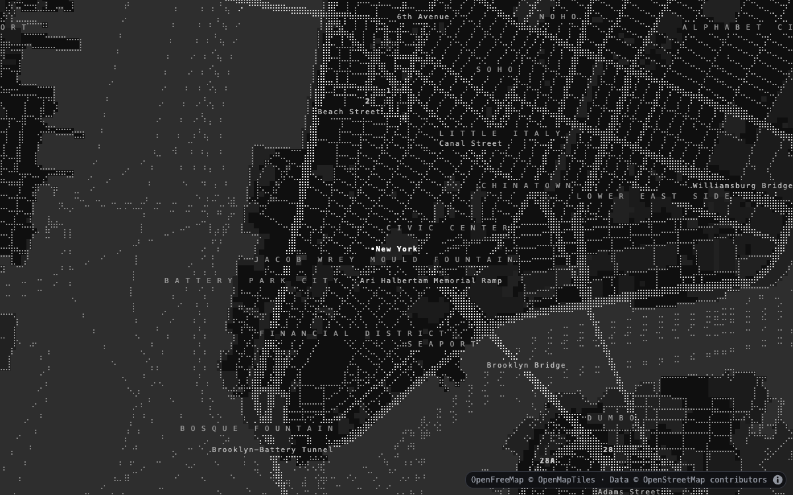 **Dark · greyscale** — streets and labels               | 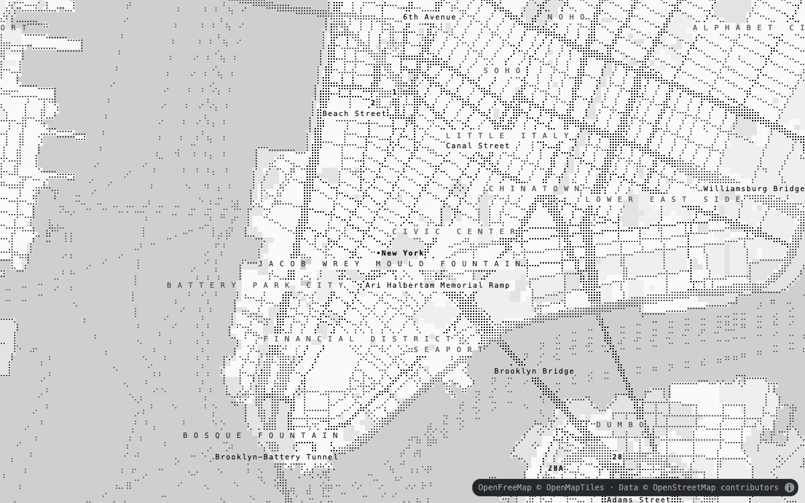 **Light · greyscale** — the same camera and detail |
| 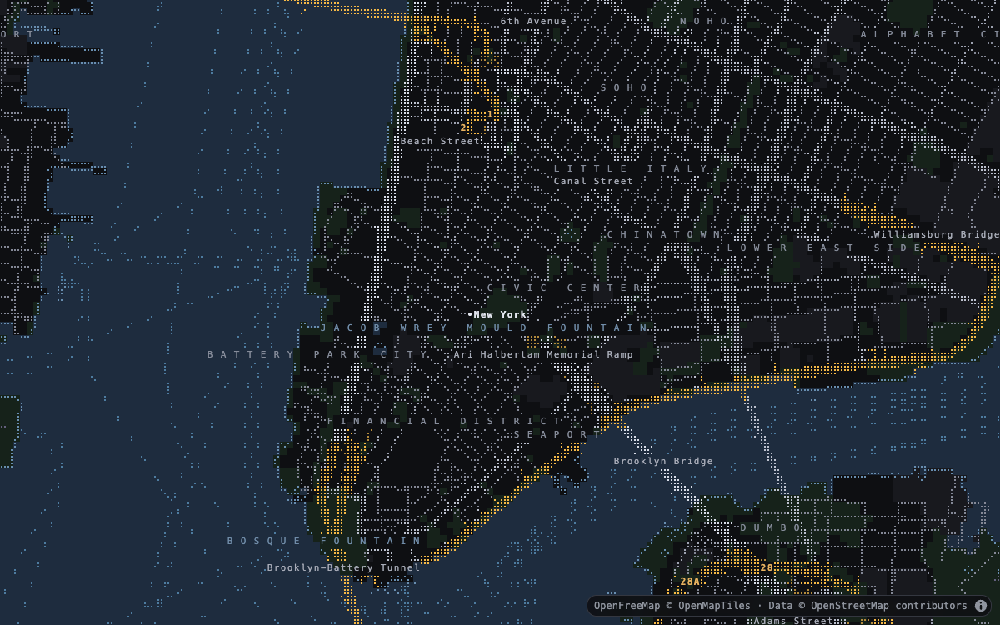 **Dark · full color** — semantic fills and ranked linework | 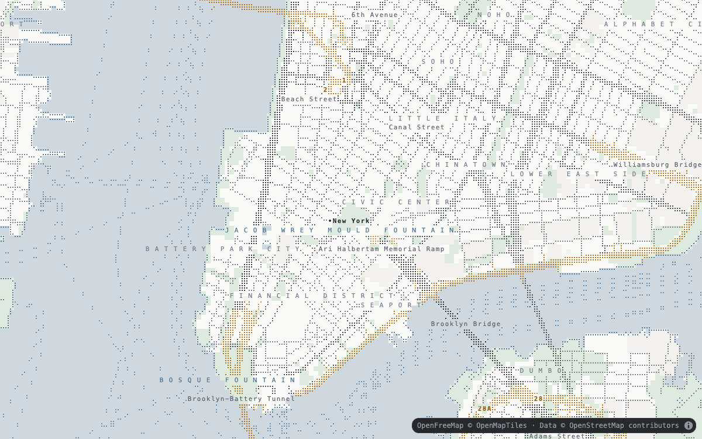 **Light · full color** — the same camera and detail   |

### Cartography and camera

| Regional and coastal detail                                                                                                                                            | Dense urban detail                                                                                                                          |
| ---------------------------------------------------------------------------------------------------------------------------------------------------------------------- | ------------------------------------------------------------------------------------------------------------------------------------------- |
| 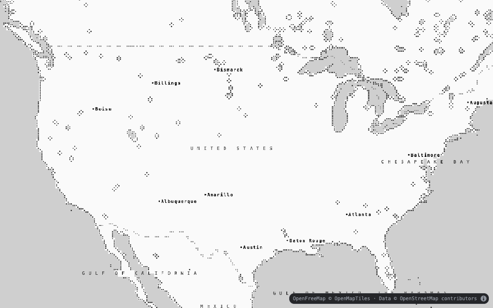 **Regional political boundaries** — low-zoom continental view | 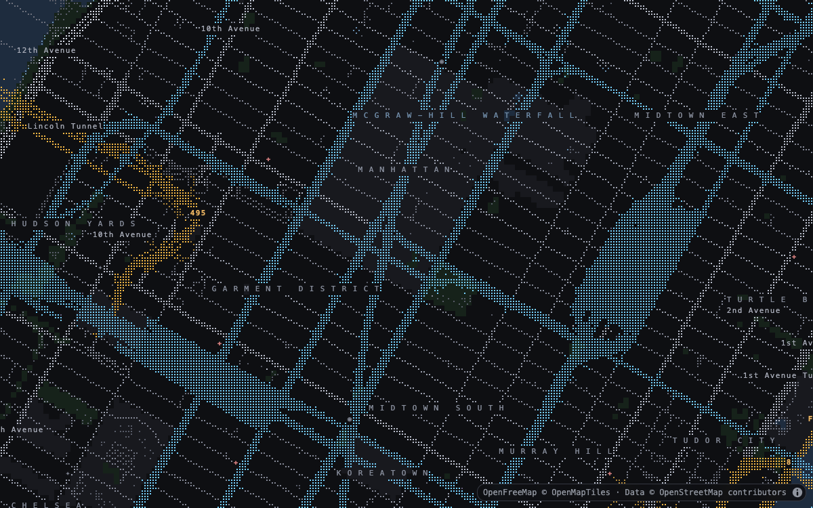 **Urban transit** — high-zoom streets, transit, and labels |
| 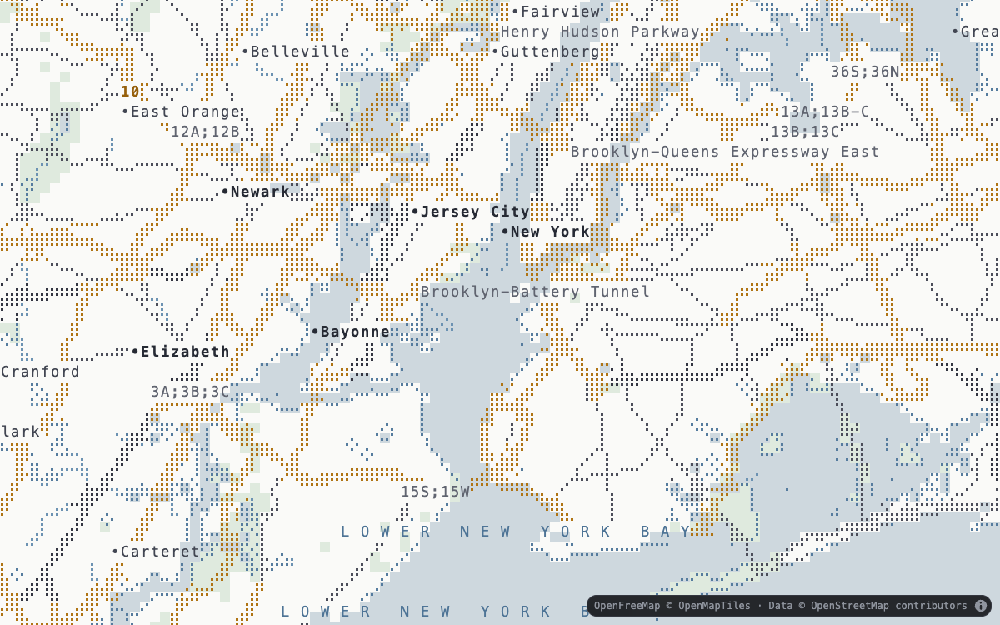 **Marine and land use** — 12 × 24 configurable cells            | 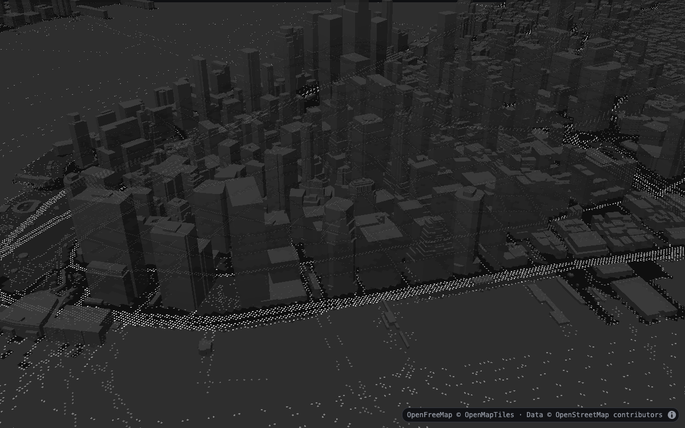 **Inked 3D buildings** — pitched surface projection    |

### Data layers

| Scalar and animated data                                                                                                                              | General GeoJSON                                                                                                                                                                                                 |
| ----------------------------------------------------------------------------------------------------------------------------------------------------- | --------------------------------------------------------------------------------------------------------------------------------------------------------------------------------------------------------------- |
| 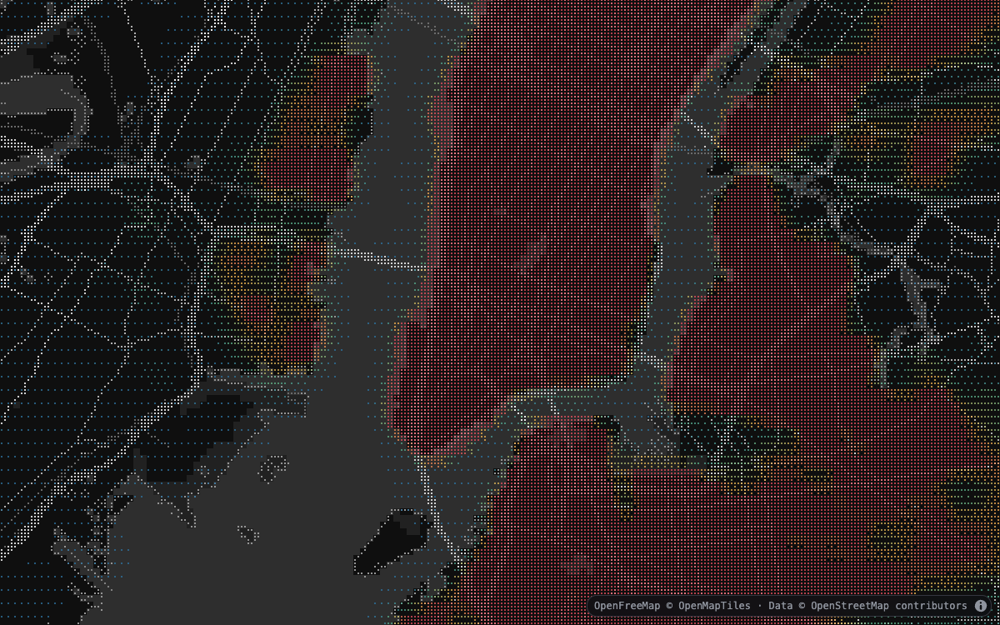 **Heatmap** — colored density over greyscale cartography | 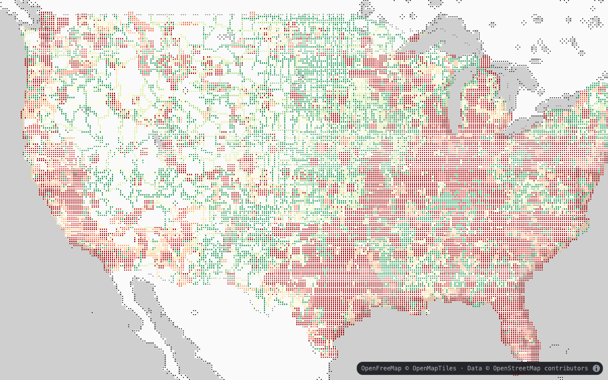 **Highway safety** — data-driven path color and width                                                         |
| 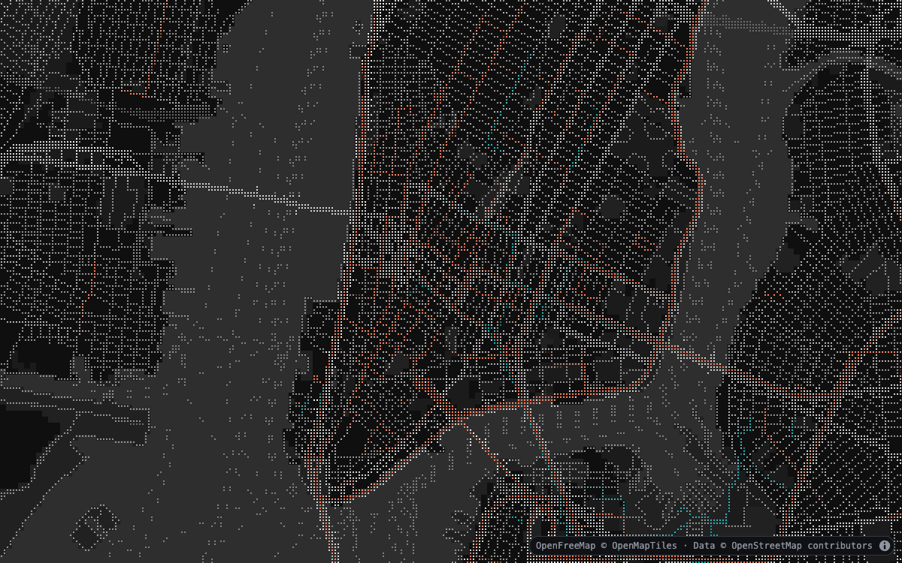 **Trips** — a deterministic frame from animated trails       | 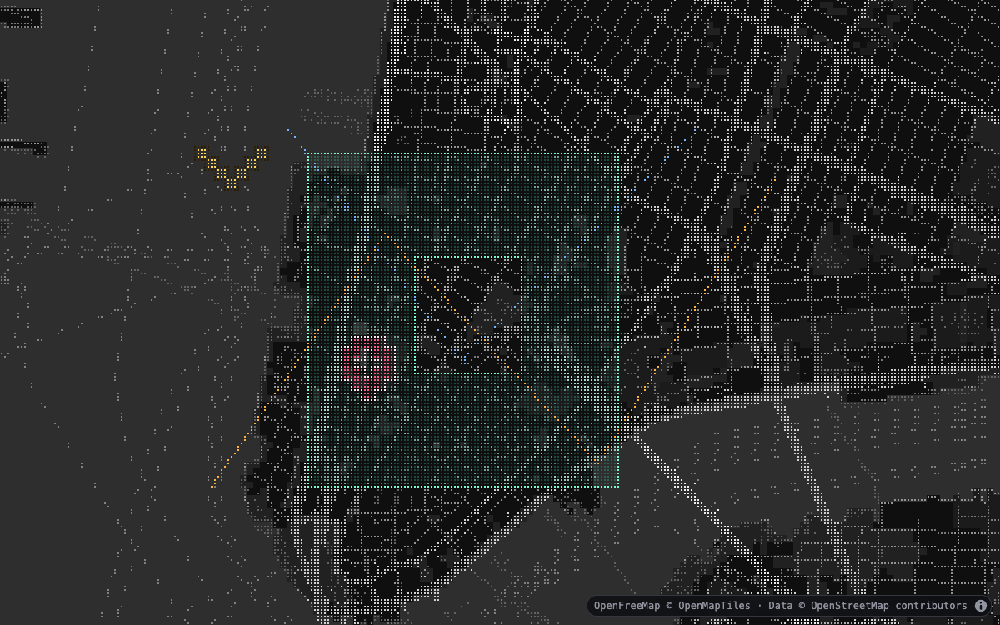 **Geometry and waypoints** — points, paths, polygon holes, locator, and caret symbols |

## See it in motion

### Animated trips

[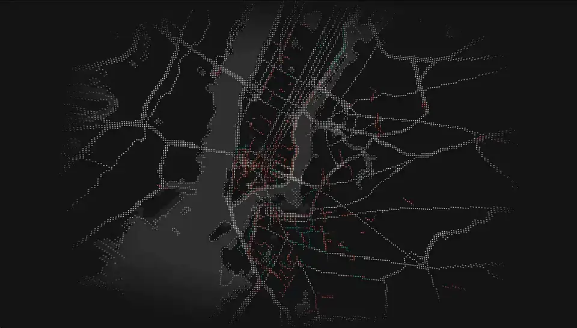](../media/animated.mp4)

### Pixelated heatmap

[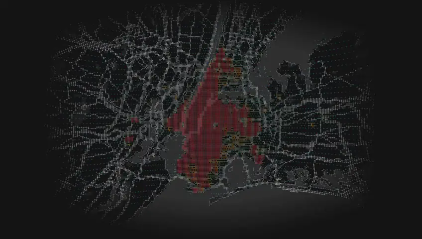](../media/heatmap.mp4)

## API reference

See the [complete API reference](/api/) for signatures, options, methods, and types.
